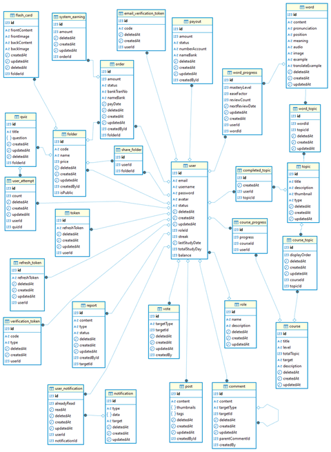

# 🚀 AstroVocab - Ứng dụng học từ vựng

AstroVocab là ứng dụng học từ vựng có phân quyền người dùng (`free` / `premium`), xác minh email qua link hoặc mã, và giới hạn tính năng linh hoạt.

---

## 🧠 Sơ đồ kiến trúc hệ thống



---

## 🔧 Biến môi trường `.env`

Tạo file `.env` ở thư mục gốc theo mẫu dưới đây:

```env
# Database
DB_NAME=your_db_name
DB_USERNAME=your_db_username
DB_PASSWORD=your_db_password
DB_PORT=3306
DB_HOST=localhost

# Server URL
HOST_URL=
HOST_FE=


# JWT
JWT_ACCESS_SECRET=
JWT_REFRESH_SECRET=

JWT_ACCESS_EXPIRE_TIME=15m
JWT_REFRESH_EXPIRE_TIME=7d

# Email
RESEND_API_KEY=re_dgTGCpsg_L7kKahscVMwF5R1uQA8uHDVB
FROM_EMAIL=noreply@astrovocab.id.vn

#VNPAY
VNPAY_TMnCode=9E7HMEQ7
VNPAY_SecretKey=FC52YAR0TS03CVGB8NKE4X61XNXB3069
VNPAY_HOST=https://sandbox.vnpayment.vn

#GOOGLE
GOOGLE_CLIENT_ID=220849696417-vqjq2u55rr2np5fbagreg616tirripbh.apps.googleusercontent.com
GOOGLE_CLIENT_SECRET=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
GOOGLE_CALLBACK_URL=http://localhost:8081/oauth/google/callback
```
